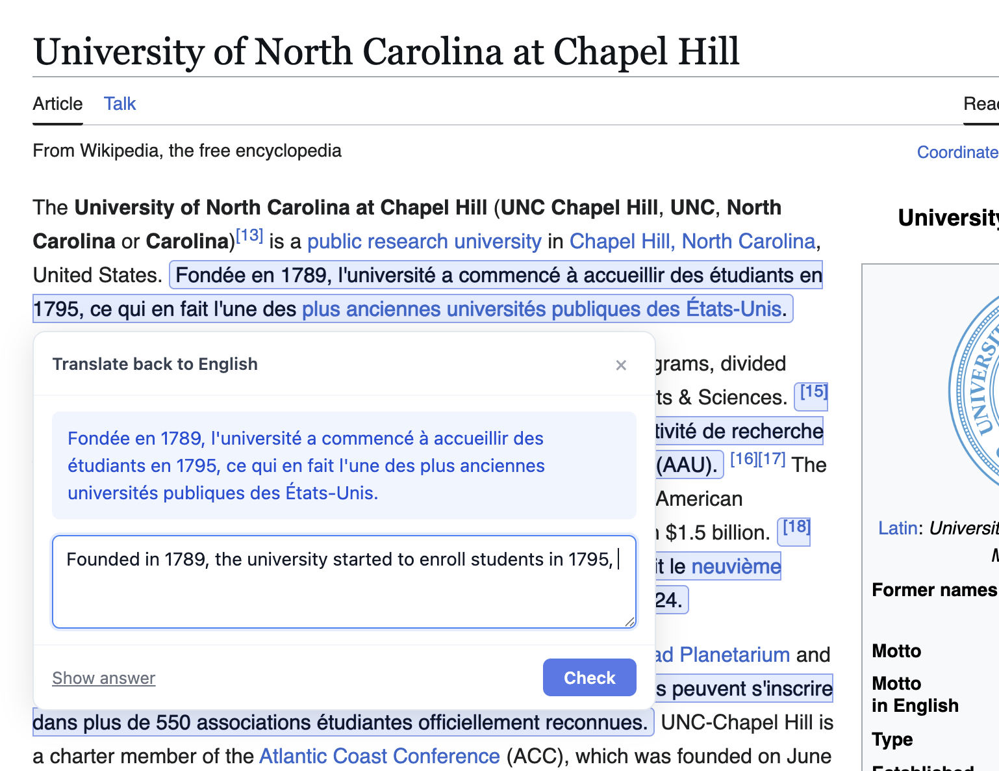
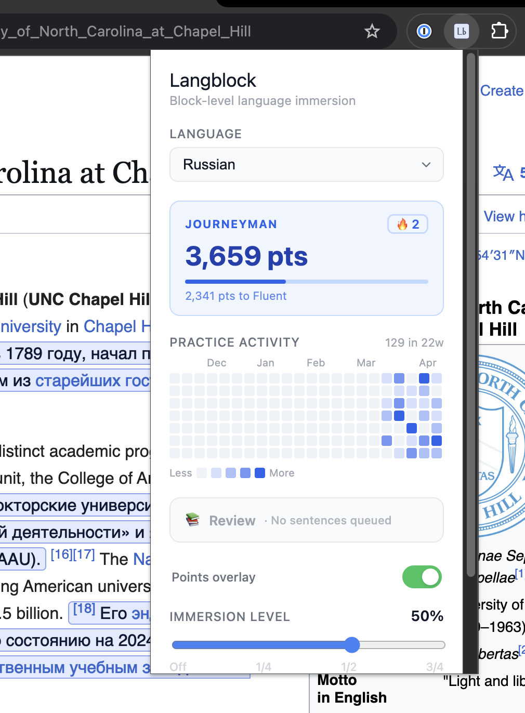
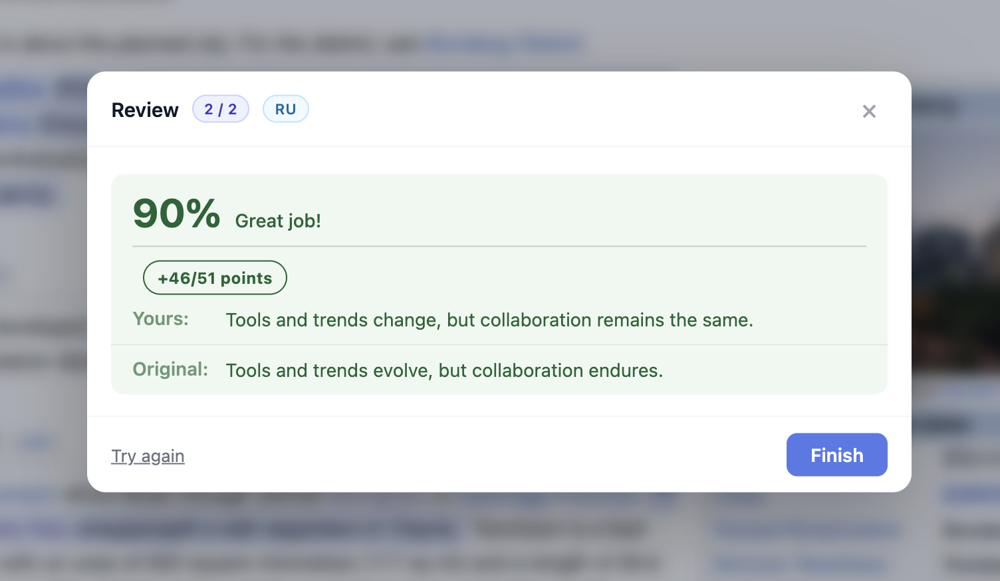

# Langblock

A Chrome extension that turns any webpage into a gentle language-learning drill. It replaces a density-controlled selection of sentences with real DeepL translations, then lets you practice translating them back via a click-to-quiz overlay scored by semantic similarity.



## Features

- Inline sentence translation on any page
   - Chinese, French, Japanese, Korean, Russian, Spanish (for now)
- Adjustable density  — how much of the page gets swapped
- Click-to-quiz overlay with cosine-similarity scoring via `Xenova/all-MiniLM-L6-v2`
- Points, streaks, and a five-tier rank system (Beginner → Polyglot)
- DeepL usage guard + local translation cache so repeat visits cost zero characters



Sentences you score low on get added to a spaced-repetition review queue. Two consecutive passes at ≥ 75% delete them.



## Stack

Manifest V3 · TypeScript · Vite · React 18 · DeepL free API · `@huggingface/transformers` + `onnxruntime-web` (offscreen document)

## Setup

```bash
npm install
echo "DEEPL_API_KEY=your-key-here" > .env
npm run build
```

Load `dist/` as an unpacked extension at `chrome://extensions`.

## Develop

```bash
npm run dev
```
